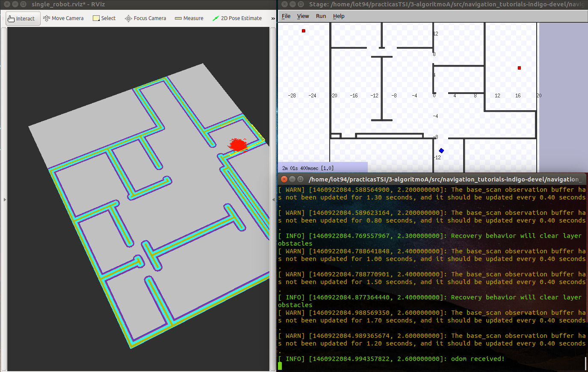

\pagebreak

# Extensión del algoritmo A*

## Modificación de estructuras de datos

Para conseguir un funcionamiento más intuitivo del algoritmo A*, hemos hecho algunos cambios en las estructuras de datos ya presentes en el código. Hemos pasado de gestionar la lista de ABIERTOS como una lista de la STL a una cola con prioridad, que nos permite insertar ordenadamente los nodos en ABIERTOS según el valor de la función $f(n)$, lo que hace que tomar el mejor nodo sea rápido y no implique un proceso de búsqueda en toda la lista.

Dicha cola con prioridad va soportada sobre un vector de la STL, y utiliza un operador de comparación para el orden. Este operador se ha implementado para los elementos `coupleOfCells`, que ha pasado de ser un *struct* a una clase para defenir el método `operator>`, que simula el comportamiento que había implementado en la función `compareFCost`.

## Implementación

El resto de la implementación consiste en seguir los pasos del algoritmo A*. Comenzamos creando el _goal_ y el _start_, e insertamos el punto de inicio en la cola de ABIERTOS. Una vez tenemos los datos iniciales, empezamos el proceso del algoritmo: tomamos el primer elemento de la cola de ABIERTOS y lo insertamos en la lista de CERRADOS. Si el elemento no es el _goal_, lo quitamos de la cola de ABIERTOS y lo expandimos, obteniendo sus nodos vecinos mediante el uso de la función `findFreeNeighborCell`. Obtenidos los vecinos, consideramos únicamente aquellos que no se encuentran en la lista de CERRADOS, y comprobamos si están en la cola de ABIERTOS, actualizando su valor si fuera necesario. Una vez aquí, repetimos el proceso.

Hemos mantenido las funciones $g(n)$ y $h(n)$ que venían en el código, que usan la distancia euclídea.

# Mejora del algoritmo A*
\label{mejoras}

En la experimentación hemos detectado que al pasarle un objetivo lejano al robot, el número de iteraciones no era suficiente para que el algoritmo A* encontrase un camino hasta dicho objetivo, lo que hacía que tuviera un comportamiento errático no deseado. Para solucionar esta situación, hemos hecho diversas modificaciones.

## Modificación del número de iteraciones

Aumentar el número de iteraciones máximas que el algoritmo puede realizar, lo que nos permite llegar a objetivos más lejanos, en el caso en el que la exploración en A* sea muy costosa.

## Adición de pesos

Para añadir un peso a la función $h(n)$, usamos una nueva función $w(n)$ que actúa como peso dinámico de la función $h(n)$. Para calcular dicho peso, dividimos el valor de la función $h$ calculada en el nodo actual entre el valor en el nodo _start_. De esta forma, conseguimos que la función $h$ pierda relevancia conforme nos vamos acercando al objetivo, tomando más importancia la distancia real hasta el punto (la función $g$) que la estimación que calculamos.

## Gestión de la resolución

Se ha reducido la resolución del mapa, para tener un menor número de nodos que explorar. Al tener una resolución demasiado alta, el número de casillas exploradas puede ser excesivo en comparación con la distancia real recorrida, lo que nos lleva a tener unos tiempos de computación altos.

## Cálculo del coste del *footprint*

Para evitar que el robot pase demasiado cerca de obstáculos e incluso se choque con ellos, se ha completado la implementación de la función `footprintCost`, que permite averiguar si la posición de la silueta del robot sobre una celda es legal (es decir, si no se choca con un obstáculo).

# Experimentación en Stage

## willow_garage

El mapa *willow_garage* es complejo y está lleno de obstáculos, por lo que se ha elegido un camino corto para ilustrar el comportamiento del algoritmo A* en nuestro robot. En una de las "habitaciones" inferiores, se ha colocado al robot en un extremo y se le ha ubicado el objetivo en el extremo opuesto de la habitación, como se observa en la Figura \ref{willow1}, que representa el camino (sobre RViz) que encuentra el robot.

Observamos en la Figura \ref{willow2} cómo las mejoras de la sección \ref{mejoras} permiten que el cálculo se haya realizado de forma rápida (aproximadamente 0,8 segundos) y el robot deje algo de espacio con los obstáculos.

\begin{figure}[hbtp]
\centering
\includegraphics[width=0.7\textwidth]{img/willow_2.png}
\caption{\label{willow2} El robot sortea los obstáculos del camino}
\end{figure}

Por último, se muestra en la Figura \ref{willow3} que el robot alcanza su objetivo con éxito.

El resto de la experimentación se han realizado en los mapas *autolab* y *simple_rooms*. En estos casos, antes de pasar a la ejecución, hemos tenido que ajustar las coordenadas de los costmap de ambos mapas, pues no se correspondian con las del stage y tampoco con las coordenadas rotadas 270º, por lo que hemos tenido que calcularlas. Han sido añadidas al archivo **amcl_node.xml** a modo de comentario.

## autolab

El mapa *autolab* es relativamente sencillo al no tener apenas obstáculos, como observamos en la figura \ref{autolab1}. El algoritmo es capaz de buscar caminos mínimos en el caso de que tenga una ruta sin muchos obstáculos, aunque debido a que la resolución del mapa es mayor a la anterior, distancias más cortas requieren de una búsqueda de mayor profundidad para obtener un camino mínimo, haciendo que la capacidad máxima de búsqueda del algoritmo pueda agotarse. Como se puede observar en la Figura \ref{autolab2}, seguimos evadiendo celdas ilegales. Finalmente, en la Figura \ref{autolab3} vemos como el robot alcanza el objetivo.

\begin{figure}[hbtp]
\centering
\includegraphics[width=0.7\textwidth]{img/autolab_2.png}
\caption{\label{autolab2} El robot se dirige el objetivo evadiendo celdas ilegales}
\end{figure}
\begin{figure}[hbtp]
\centering
\includegraphics[width=0.7\textwidth]{img/autolab_3.png}
\caption{\label{autolab3} El robot alcanza el objetivo}
\end{figure}

## simple_rooms

El mapa *simple_rooms* como el anterior carece de obstáculos, pero al ser habitaciones cerradas con una única salida y tener también una resolución mayor que el *willow* es posible que no encuentre un camino por falta de capacidad. En este caso se ha probado a avanzar con el robot dando objetivos cercanos sin muchos obstáculos o con obstáculos que pueden evitarse fácilmente, de esta manera el algoritmo encuentra soluciones con bastante rapidez como podemos ver en las figuras \ref{simple2} y \ref{simple3}, sin embargo una vez nos hemos avanzado lo suficiente, probamos a darle un objetivo cercano pero obstaculizado por las paredes como en la figura \ref{simple4}, como podemos observar en la última figura \ref{simple5}. No es posible encontrar un plan debido a la resolución actual del mapa y su forma ya que excede la capacidad.

\begin{figure}[hbtp]
\centering
\includegraphics[width=0.7\textwidth]{img/simple_1.png}
\caption{\label{simple1} El robot en su pose inicial}
\end{figure}
\begin{figure}[hbtp]
\centering
\includegraphics[width=0.7\textwidth]{img/simple_2.png}
\caption{\label{simple2} El robot alcanza un objetivo cercano}
\end{figure}
\begin{figure}[hbtp]
\centering
\includegraphics[width=0.7\textwidth]{img/simple_3.png}
\caption{\label{simple3} El robot alcanza el objetivo cercano}
\end{figure}
\begin{figure}[hbtp]
\centering
\includegraphics[width=0.7\textwidth]{img/simple_4.png}
\caption{\label{simple4} Se envia objetivo obstaculizado al robot}
\end{figure}
\begin{figure}[hbtp]
\centering
\includegraphics[width=0.7\textwidth]{img/simple_5.png}
\caption{\label{simple5} No se encuentra plan para el robot}
\end{figure}
